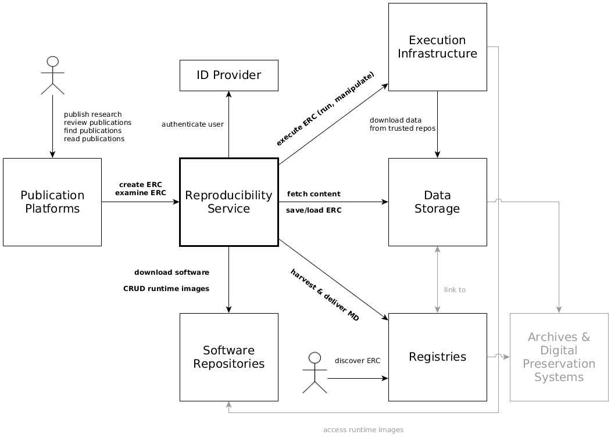

## 3. System scope and context

### 3.1 Business context

Communication partner | Exchanged data | Technology/protocol
--------------------- | ------ | -------
**Reproducibility service**, e.g. [o2r](http://o2r.info/results) | publication platforms utilize creation and examination services for ERC, reproducibility service uses repositories to retrieve software artifacts, store runtime environment images, and save complete ERC | `HTTP` APIs |
**Publication platform**, e.g. online journal website and review system | users access ERC status and metadata via search results and paper landing pages; review process integrates ERC details and supports manipulation; | system's API using `HTTP` with `JSON` payload
[//]: <> (**Third party** websites or services | third parties can browse, search, view, download, ... ERC via the system API | RESTful `HTTP` with `JSON` or archive payloads (`zip`, `tar.gz`))
**ID provider** | retrieve unique user IDs, user metadata, and authentication tokens; user must log in with the provider | `HTTP`
**Execution infrastructure** | ERC can be executed using a shared/distributed infrastructure | `HTTP`
**Data repository** | the reproducibility service fetches (a) content for ERC creation, or (b) complete ERC, from different sources and stores crated ERC persistently at suitable repositories | `HTTP`, `FTP`, `WebDAV`, `git`
**Registry** | the reproducibility service can deliver metadata on published ERC to registries/catalogues/search portals, but also retrieve/harvest contextual metadata during ERC creation; users discover ERC via registries | (proprietary) `HTTP` APIs, persistent identifiers (`DOI`), `OAI-PMH`
**Software repository** | software repository provide software artifacts during ERC creation and store executable runtime environments | `HTTP` APIs
**Archives and digital preservation systems** | when information is transferred from the private (research group, single researcher) or group domain (collaborations) to a public and persistent domain (archives, repositories), then extended data and metadata management is needed but also different access and re-use is enabled; these concerns are only relevant in so far as _data repositories_ must be supported, but further aspects such as access rights in archives are only mediately relevant for the reproducibility service | metadata in `JSON` and `XML` provided via `HTTP` or as files

### 3.2 Technical context

All components use `HTTP` over cable networks connections for communication of all exchanged data (metadata documents, ERC, Linux containers, etc.).
