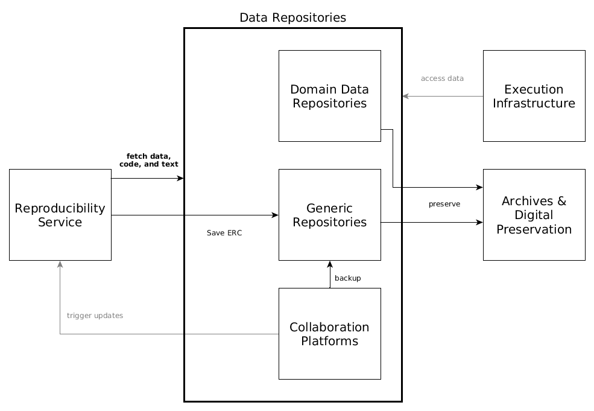

## 5. Building block view

### 5.1 Refinement Level 1

#### 5.1.1 Blackbox Publication Platforms

Publications platforms are the primary online interaction point of users with scientific works.
Users consume publications, e.g. browsing, searching, and reading.
Users create publications, e.g. submitting to a scientific journal.

#### 5.1.2 Blackbox ID Provider

Identification information of distributed systems is crucial, and for security reasons as well as for limiting manual reproduction of metadata, a central service can provide all of

- unique _identification of users_ and _metadata on users_,
- _authentication_ of users, and
- metadata on a user's _works_, e.g. publications or ERC.

<!--
**artifact IDs** (if needed)

A URI provider, e.g. [ePIC](http://www.pidconsortium.eu/?page_id=74) allows the reproducibility service to retrieve persistent identifiers for own landing pages, retrieved via and `HTTP` API, see [ePIC docs](http://doc.pidconsortium.eu/guides/overview/).
-->

#### 5.1.3 Blackbox Execution Infrastructure

The execution infrastructure provides CPU time and temporary result storage space for execution of ERC, both "as is" and with manipulation, i.e. changed parameters.

#### 5.1.4 Blackbox Data Repositories

Data repositories are all services and platforms that store data but not software. They may be self-hosted or public free platforms.
They are used both for loading content that is used to build an ERC and for storing the ERC created by the reproducibility service.

#### 5.1.5 Blackbox Registries

Registries are metadata indexes or catalogues.

They are recipients of metadata exports by the reproducibility service to share information about ERC, e.g. add a new ERC to an author's profile.
This requires the reproducibility services to translate the internal metadata model into the recipients data model and encoding. 

They are sources of metadata during ERC creation when the information in the fetched content is used to query registries for additional information which can be offered to the user.

#### 5.1.6 Blackbox Software Repositories

Software repositories are a source and a sink for software at different abstraction levels.
They are a source for software artifacts or packages, such as system packages in install a library or language-specific extension packages.
They are a sink for executable images of software, which comprise a number of software artifacts, for a specific ERC instance.

### 5.2 Refinement Level 2

#### 5.2.1 Whitebox Publication Platforms

Publication platforms can be roughly divided into two groups.
They can be specific journals hosted independently, such as [JStatSoft](http://www.jstatsoft.org/), or be a larger platform provided by a publisher to multiple journals, such as [ScienceDirect](http://sciencedirect.com/), [MDPI](http://www.mdpi.com/), [SpringerLink](https://link.springer.com/), or [PLOS](https://plos.org/).

Integration with the reproducibility service can happen via plug-ins to open platforms, e.g. [OJS](https://pkp.sfu.ca/ojs/), or by bespoke extensions based on the service's public API.

#### 5.2.2 Whitebox ID Provider

The reproducibility service uses [ORCID](http://orcid.org/) to authenticate users and retrieve user and works metadata.
Internally, the user's public `ORCID` is the main identifier.

#### 5.2.3 Whitebox Execution Infrastructure

Such an infrastructure could be either self-hosted, e.g. [Docker Swarm](https://www.docker.com/products/docker-swarm)-based, or use a cloud service provide, such as [Amazon EC2](https://aws.amazon.com/ec2/), [Docker Cloud](http://cloud.docker.com/), or even use continuous integration platforms such as [Travis CI](https://travis-ci.org/) or [Gitlab CI](https://about.gitlab.com/gitlab-ci/).

#### 5.2.4 Whitebox Data Repositories

**Collaboration platforms**, e.g. ownCloud/Sciebo, GitHub, ShareLatex, [OSF](https://osf.io/), allow users to create, store, and share their research.
The reproducibility service fetches contents for building an ERC from these platforms based on public links, e.g. GitHub repository or Sciebo shared folder.
It is possible that ERC creation is linked persistently to such collaboration platforms and updates to a shared storage cause ERC creation, execution etc.

Protocols: `WebDAV`, `ownCloud`, `HTTP`, `git`

**Domain data repositories**, e.g. [PANGAEA](https://www.pangaea.de/) or [GFZ Data Services](http://dataservices.gfz-potsdam.de/portal/), can be accessed by the reproducibility service during creation and execution of ERC to download data.
Allowing access to data repositories reduces data duplication but requires control over/trust in the respective repository.

Protocol: `HTTP` APIs

Generic **Repositories**, e.g. [Zenodo](https://zenodo.org/), [Mendeley Data](https://data.mendeley.com/), [Figshare](http://figshare.com/), [OSF](https://osf.io/), provide (a) access to complete ERC stored in repositories for inspection and execution by the reproducibility service, and (b) storage of created ERC. repositories.

The reproducibility service _does not persistently store anything_.

Protocols: (authenticated) `HTTP` APIs

**Archives**, e.g. using an installation of [Archivematica](https://www.archivematica.org/), might provide long-term preservation of ERC. Preservation lies in the responsibility of the repository, which might save the hosted content to an archive, or an archive harvests a repository.

Protocol: `HTTP` carrying bitstreams and metadata

#### 5.2.5 Whitebox Registries

TBD ([CRIS](https://www.uni-muenster.de/FB7_MultimediaSupport/CRIS_Infoseite/Forschungsdatenbank_Infoseite.html), [DataCite](https://www.datacite.org/), [Google Scholar](https://scholar.google.de/), [Scopus](https://www.scopus.com/), ...)

#### 5.2.6 Whitebox Software Repositories

##### 5.2.6.1 Blackbox Package repositories

Package repositories are used during ERC creation to download and install software artifacts for specific operating systems, e.g. [Debian APT](https://wiki.debian.org/Apt) or [Ubuntu Launchpad](https://launchpad.net/ubuntu), for specific programming languages or environments, e.g. [CRAN](https://cran.r-project.org/), or from source, e.g. [GitHub](https://github.com/).

##### 5.2.6.2 Blackbox Container registries

Container registries such as [Docker Hub](https://hub.docker.com/), [Quay](https://quay.io/), self-hosted [Docker Registry 2.0](https://github.com/docker/distribution) or [Amazon ERC](https://aws.amazon.com/de/ecr/), store executable images of runtime environments.
They can be used to distribute the runtime environments across the execution infrastructure and provide an intermediate ephemeral storage for the reproducibility service.

#### 5.2.7 Whitebox Reproducibility Service

##### 5.2.7.1 Blackbox Webserver

A webserver handles all incoming calls to the API and distributes them to the respective microservice.
A working [nginx](https://nginx.org) configuration is available [in the test setup](https://github.com/o2r-project/o2r-platform/blob/master/test/nginx.conf).

##### 5.2.7.2 Blackbox UI

The UI is a web application based on [Angular JS](https://angularjs.org/), see [o2r-platform](https://github.com/o2r-project/o2r-platform).
It connects to an execution microservice (µservice) for real-time WebSocket-based notifications.

##### 5.2.7.3 Blackbox microservices

The reproducibility service uses a [microservice architecture](https://en.wikipedia.org/wiki/Microservices) to separate functionality defined by the **[web API specification](http://o2r.info/o2r-web-api)** into manageable units.

This allows scalability (selected µservices can be deployed as much as needed) and technology independence for each use case and developer.
The µservices all access one main database and a shared file storage.

##### 5.2.7.4 Blackbox Tools

Some functionality is developed as standalone tools and used as such in the µservices instead of re-implementing features.
These tools are integrated via their command line interface (CLI).

##### 5.2.7.5 Blackbox Database

The main database is the unifying element of the microservice architecture.
All information shared between µservices or transactions between microservices are made via the database, including session state handling (= authentication).

A search database/index is used for full-text search and advanced search queries.

The database's operation log, normally used for synchronization between database nodes, is also used for 

- event-driven communication between microservices, and
- synchronization between main document database and search index.

This "eventing hack" is expected to be replaced by a proper eventing layer for productive deployments.

##### 5.2.7.6 Blackbox Ephemeral file storage

After loading from external sources and during creation of ERC, the files are stored in a file storage shared between the µservices.
The file structure is known to each microservice and read/write operations happen as needed.

### 5.3 Refinement Level 3

#### 5.3.1 Whitebox µservices

Each microservice is encapsulated as a [Docker](http://docker.com/) container running at its own port on an internal network and only serving its respective API path.
For testing or developing the [o2r-platform](https://github.com/o2r-project/o2r-platform) GitHub project contains [docker-compose](https://docs.docker.com/compose/compose-file/) configurations to run all microservices, see the repository's directory `/test` and check the projects `README.md` for instructions.

##### ERC creation and examination

**Project** | **API path** | **Language** | **Description**
------ | ------ | ------ | ------
[muncher](https://github.com/o2r-project/o2r-muncher) | `/api/v1/compendium` and `/api/v1/job`  | JavaScript (Node.js) | core component for CRUD of compendia and jobs (ERC execution)
[loader](https://github.com/o2r-project/o2r-loader) | `/api/v1/compendium` (`HTTP POST` only) |  JavaScript (Node.js) | load workspaces from repositories and cloud platforms
[finder](https://github.com/o2r-project/o2r-finder) | `/api/v1/search` | JavaScript (Node.js) | discovery and search, synchronizes the database with a search database (Elasticsearch) and exposes read-only search endpoints
[transporter](https://github.com/o2r-project/o2r-transporter) | `~ /data/` and `~* \.(zip|tar|tar.gz)` | JavaScript (Node.js) | downloads of compendia in zip or (gzipped) tar formats
[informer](https://github.com/o2r-project/o2r-informer) | `~* \.io` | JavaScript (Node.js) | [socket.io](http://socket.io/)-based WebSockets for live updates to the UI based on database event log, e.g. job progress
[substituter](https://github.com/o2r-project/o2r-substituter) | `/api/v1/substitution` |  JavaScript (Node.js) | create new ERCs based on existing ones by substituting files
[manipulater](https://github.com/o2r-project/o2r-manipulater/) | `under development` | -- | provide back-end containers for interactive ERCs
[inspecter](https://github.com/o2r-project/o2r-inspecter) | `under development` | -- | allow inspection of non-text-based file formats, e.g. `.Rdata`

##### ERC exporting

**Project** | **API path** | **Language** | **Description**
------ | ------ | ------ | ------
[shipper](https://github.com/o2r-project/o2r-shipper) | `/api/v1/shipment` | Python | ship ERCs, including packaging, and their metadata to third party repositories and archives

##### Authentication

**Project** | **API path** | **Language** | **Description**
------ | ------ | ------ | ------
[bouncer](https://github.com/o2r-project/o2r-bouncer) | `/api/v1/auth`, `/api/v1/user/` | JavaScript (Node.js) | authentication service and user management (whoami, level changing)

#### 5.3.2 Whitebox database

Two databases are used.

**[MongoDB](https://www.mongodb.com/) document database** with enabled [replica-set oplog](https://docs.mongodb.com/manual/core/replica-set-oplog/) for eventing.

Collections:

- `users`
- `sessions`
- `compendia`
- `jobs`
- `shipments`

The MongoDB API is used by connecting µservices via suitable client packages, which are available for all required languages.

**[Elasticsearch](https://elastic.co) search index**, kept in sync with the main document database by the µservice `finder`.
The ids are mapped to support update and delete operations.

Index: `o2r`

Types:

- `compendia`
- `jobs`

The search index is accessed by the UI through the search endpoint provided by `finder`.

#### 5.3.3 Whitebox tools

**project** | **language** | **description**
------ | ------ | ------
[meta](https://github.com/o2r-project/o2r-meta) | Python | scripts for extraction, translation and validation of metadata
[containerit](https://github.com/o2r-project/containerit) | R | generation of Dockerfiles based on R sessions and scripts

#### 5.3.4 Whitebox ephemeral file storage

A host directory is mounted into every container to the same location: `/tmp/o2r:/tmp/o2r`
